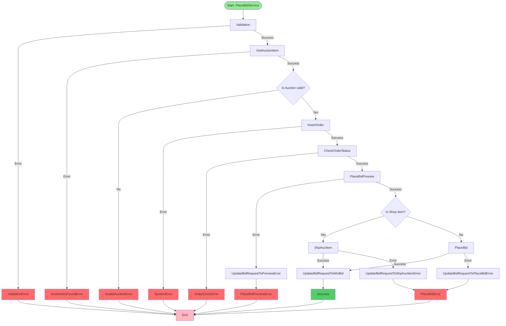

# PlaceBidService Flowchart

## Flow Description

1. **Validation Phase**: Validates all required fields (YsRefID, TransactionType, AuctionID, Price, Quantity)
2. **Auction Item Retrieval**: Fetches the auction item and performs basic validations (status, price, quantity)
3. **Order Creation**: Creates and inserts the bid request order into the database with status "CREATED"
4. **Bid Preview**: Calls the preview API to get the signature required for placing the bid
5. **Transaction Type Handling**:
   - **BID**: Currently not supported, returns error
   - **BUYOUT**: Places the bid and updates order status to "WIN_BID" on success
6. **Error Handling**: Updates order status to "FAILED" with error message when operations fail

## Notes

- Several validation checks are marked as TODO and don't currently return errors
- The function only supports BUYOUT transactions currently
- Database operations are performed at multiple points to track order status
- All errors are logged before being returned

